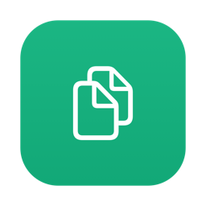
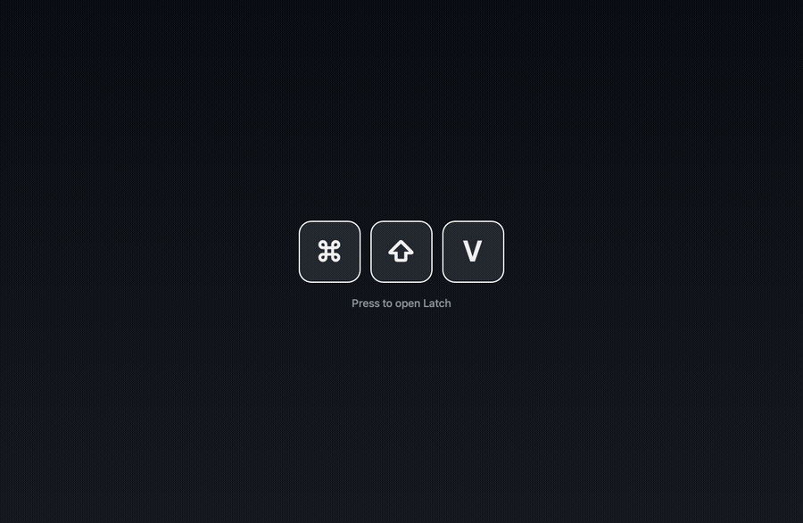

<div align="center">



# Latch

**The friendly, private clipboard for macOS.**
Copy once, paste anywhere — with one keystroke, and nothing ever leaves your Mac.

[](https://github.com/MiladNalbandi/latch/releases)
[](https://github.com/MiladNalbandi/latch/releases)


<br>

```sh
brew tap miladnalbandi/latch https://github.com/MiladNalbandi/latch
brew install --cask latch
```

<br>



</div>

## About

Latch is a tiny menu-bar utility that records your clipboard history and brings any past
copy back instantly through a frosted, Spotlight-style panel (**⌘⇧V**). It captures text,
rich text, images, files, links, colors, and code; skips passwords; pins your favorites;
and stores everything **encrypted on-device** — no account, no network, no telemetry.

Native AppKit + SwiftUI. No Electron. The whole thing is a single, fast menu-bar app.

## Features

- Spotlight-style panel opened anywhere with a global hotkey (**⌘⇧V**).
- Instant fuzzy search — just start typing the moment it opens.
- Captures text, rich text, images, files, links, colors, and code, auto-classified by type.
- Filter by type (All · Pinned · Links · Text · Code · Colors) — cycle with **Tab**.
- Keyboard-first: **↩** to paste back, **⌘1–9** to quick-pick, **⌘F** to refocus search, **⎋** to close.
- Auto-paste — drop the clip straight into the app you came from (optional; needs Accessibility).
- Pin favorites so they survive automatic history trimming.
- Encrypted at rest with AES-GCM; the key lives in your login Keychain.
- Privacy controls: skips passwords, incognito pause, and clear-history-on-lock.
- Frosted-glass UI that follows your macOS **accent color** and **light/dark** appearance automatically.
- First-run welcome and a re-openable quick tutorial from the menu bar.
- Universal build (Apple Silicon + Intel), runs as a lightweight menu-bar agent.

## Requirements

- macOS 13 (Ventura) or later.
- Universal — Apple Silicon and Intel.

## Install

Homebrew instructions are at the top of this README. To install manually instead:

1. Download the latest **`Latch-<version>.dmg`** from the [**Releases**](https://github.com/MiladNalbandi/latch/releases) page.
2. Open it and drag **Latch** into **Applications**.
3. First launch: right-click **Latch.app → Open** (this build is unsigned, so Gatekeeper asks once).
   If macOS says it's "damaged", clear the quarantine flag:
   ```sh
   xattr -dr com.apple.quarantine /Applications/Latch.app
   ```

Verify your download against the published `.sha256` next to the DMG.

## Usage

| Shortcut | Action |
| --- | --- |
| **⌘⇧V** | Open the clipboard history panel |
| *type* | Search instantly |
| **Tab** / **⇧Tab** | Cycle filters |
| **↑ / ↓** | Move selection |
| **↩** | Paste the selected clip |
| **⌘1–9** | Quick-pick the Nth clip |
| **⌘F** | Refocus search |
| **⎋** / click outside | Close the panel |
| **⌘⌥V** | Quick-paste the most recent clip without opening the panel |

Shortcuts, auto-paste, privacy options, and launch-at-login live in **Settings** (menu-bar icon → Preferences).

## Local development

Requires a Mac with Xcode and [XcodeGen](https://github.com/yonaskolb/XcodeGen).

```sh
brew install xcodegen      # one-time
make gen                   # generate Latch.xcodeproj (gitignored)
make build                 # build the app
make run                   # launch it
make test                  # run engine unit tests
make check                 # format-check + lint + build + test (run before pushing)
```

`project.yml` is the source of truth; the generated `.xcodeproj` is gitignored. The only
third-party dependency is [KeyboardShortcuts](https://github.com/sindresorhus/KeyboardShortcuts).

### Releasing

Push a `v*` tag (or bump `RELEASE_VERSION`) and CI builds a universal Release app, ad-hoc
signs it, packages a `.dmg` (+ `.sha256`), and publishes a GitHub Release:

```sh
git tag v0.2.0 && git push origin v0.2.0
```

## Architecture

`LatchApp` (UI) depends on `LatchEngine` (core); the engine never imports UI.
`NSPasteboard` / `NSWorkspace` / Keychain are hidden behind protocols so the logic is
unit-testable with fakes.

```
Sources/LatchEngine/      testable core — capture, classify, store, encrypt, search
Sources/LatchApp/         AppKit + SwiftUI UI — menu bar, panel, settings, design system
Tests/LatchEngineTests/   engine unit tests
specs/                    spec-driven requirements / design / tasks per feature
design/                   the Latch design system (tokens, components, kits)
```

- [`ARCHITECTURE.md`](ARCHITECTURE.md) — layering, boundaries, data flow, conventions.
- [`CONTRIBUTING.md`](CONTRIBUTING.md) — local setup, `make` commands, quality gates.
- [`specs/README.md`](specs/README.md) — per-feature requirements / design / tasks.

## Privacy

Your clipboard never leaves your Mac. History is encrypted on-device (AES-GCM, key in the
Keychain), there is no account, and the app makes no network requests.

## License

Latch is free software, licensed under the **GNU General Public License v3.0** — see [LICENSE](LICENSE).
